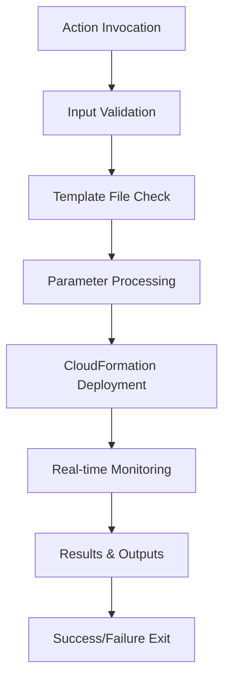

# Design Document

## Overview

The CloudFormation Deployment Action is a composite GitHub Action that provides a standardized way to deploy AWS CloudFormation stacks from infrastructure code stored in GitHub repositories. The action encapsulates the complexity of parameter parsing, deployment monitoring, and error handling while providing a simple interface for users.

The action leverages the AWS CLI for CloudFormation operations and includes sophisticated parameter handling to support both simple key-value JSON and CloudFormation-native parameter formats. Real-time monitoring provides visibility into deployment progress through CloudFormation stack events.

## Architecture

### High-Level Flow


### Component Architecture
The action follows GitHub Actions composite action pattern with the following components:

1. **Input Handler**: Processes and validates the three input parameters
2. **Template Validator**: Ensures CloudFormation template exists and is accessible
3. **Parameter Processor**: Converts JSON parameters to CloudFormation format
4. **Deployment Engine**: Executes CloudFormation deployment with monitoring
5. **Event Monitor**: Tracks and displays deployment progress
6. **Output Handler**: Processes and displays final results

## Components and Interfaces

### Action Metadata (action.yaml)
```yaml
name: 'Deploy CloudFormation Stack'
description: 'Deploy AWS CloudFormation stacks with parameter support and real-time monitoring'
inputs:
  stack-name:
    description: 'Name of the CloudFormation stack to deploy'
    required: true
  stack-path:
    description: 'Path to the CloudFormation template file'
    required: true
  deployment-parameters:
    description: 'CloudFormation parameters as JSON string'
    required: false
    default: 'null'
```

### Environment Variables
The action uses environment variables to pass data between validation and deployment phases:
- `DEPLOYMENT_STACK_NAME`: Stack name from input
- `DEPLOYMENT_TEMPLATE_PATH`: Template file path from input  
- `DEPLOYMENT_PARAMETERS`: JSON parameters from input

### Parameter Processing Logic
The parameter processor handles two JSON formats:

**CloudFormation Native Format:**
```json
[
  {"ParameterName": "Environment", "ParameterValue": "production"},
  {"ParameterName": "InstanceType", "ParameterValue": "t3.micro"}
]
```

**Simple Key-Value Format:**
```json
{
  "Environment": "production",
  "InstanceType": "t3.micro"
}
```

Both formats are converted to AWS CLI parameter overrides: `Environment=production InstanceType=t3.micro`

### Deployment Monitoring
The monitoring system uses background process management:
1. Start CloudFormation deployment as background process
2. Poll stack events every 10 seconds while deployment runs
3. Display formatted event table with key information
4. Wait for deployment completion and capture exit code

## Data Models

### Input Parameters
```typescript
interface ActionInputs {
  stackName: string;           // Required: CloudFormation stack name
  stackPath: string;           // Required: Path to template file
  deploymentParameters?: string; // Optional: JSON parameter string
}
```

### Parameter Formats
```typescript
// CloudFormation native format
interface CFNParameter {
  ParameterName: string;
  ParameterValue: string;
}

// Simple key-value format
interface SimpleParameters {
  [key: string]: string;
}
```

### Stack Event Display
```typescript
interface StackEvent {
  Time: string;              // Event timestamp
  Status: string;            // Resource status
  Type: string;              // Resource type
  LogicalId: string;         // Logical resource ID
  Reason?: string;           // Status reason
}
```

## Error Handling

### Template Validation Errors
- **Missing Template**: Exit with code 1 and clear error message
- **Invalid Template**: AWS CLI validation errors are displayed
- **Access Issues**: File permission errors are caught and reported

### Parameter Processing Errors
- **Invalid JSON**: jq parsing errors are caught and reported
- **Format Detection**: Automatic fallback between parameter formats
- **Empty Parameters**: Graceful handling with null/empty parameter sets

### Deployment Errors
- **AWS CLI Failures**: Exit codes are propagated from aws cloudformation deploy
- **Stack Conflicts**: CloudFormation error messages are displayed
- **Permission Issues**: IAM capability errors are shown with context
- **Monitoring Failures**: Event polling errors don't fail deployment

### Error Recovery
- Template validation runs before deployment starts
- Parameter parsing is tested with dry-run validation
- Monitoring failures are logged but don't interrupt deployment
- Final stack state is always retrieved regardless of monitoring issues

## Testing Strategy

### Unit Testing Approach
Since this is a composite GitHub Action, testing focuses on:

1. **Input Validation Testing**
   - Test all required/optional parameter combinations
   - Validate parameter format detection logic
   - Test error handling for invalid inputs

2. **Parameter Processing Testing**
   - Test CloudFormation native format parsing
   - Test simple key-value format parsing
   - Test parameter conversion to CLI format
   - Test edge cases (empty, null, malformed JSON)

3. **Template Validation Testing**
   - Test existing template file scenarios
   - Test missing template file handling
   - Test template access permission issues

4. **Integration Testing**
   - Test with real CloudFormation templates
   - Test deployment success and failure scenarios
   - Test monitoring output formatting
   - Test AWS CLI integration

### Test Environment Requirements
- AWS CLI configured with appropriate permissions
- Sample CloudFormation templates for testing
- GitHub Actions runner environment
- Mock AWS responses for unit tests

### Continuous Integration
- Action testing in GitHub Actions workflows
- Matrix testing across different template types
- Parameter format validation tests
- AWS permission boundary testing

## Security Considerations

### AWS Credentials
- Action relies on pre-configured AWS credentials in runner environment
- No credential handling or storage within the action
- Supports all standard AWS credential methods (IAM roles, access keys, etc.)

### IAM Capabilities
- Automatically includes CAPABILITY_IAM and CAPABILITY_NAMED_IAM
- No user confirmation required for IAM resource creation
- Follows principle of least privilege for CloudFormation operations

### Parameter Security
- Parameters are processed in memory only
- Temporary files (params.json) are created in runner workspace
- No parameter values are logged in plain text
- JSON parsing uses secure jq operations

### Template Security
- Templates are read from repository filesystem only
- No remote template fetching or URL processing
- Template validation occurs before deployment
- File access follows GitHub Actions security model